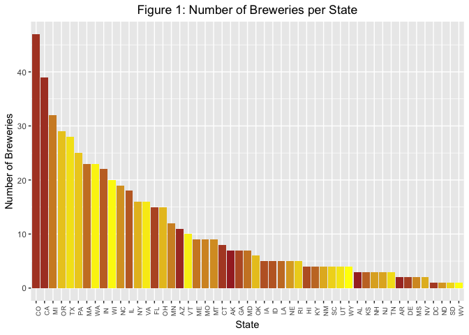

# Introduction

In 2017, 83 percent of all beer was domestically produced, and 17 percent was imported from more than 100 different countries around the world. Based on beer shipment data and U.S. Census population statistics, U.S. consumers 21 years and older consumed 26.9 gallons of beer and cider per person during 2017. (Source: https://www.nbwa.org/resources/industry-fast-facts)

Consumers have many options on the choice of beer they drink today. The beer industry is saturated with regards to production and consumption over the past 10 years. To ward off competition, and to earn a position in the market, it is imperative that brewing companies come up with new strategies. However, large breweries still have the majority market share.

This study will help one of our clients on a marketing campaign. This analysis will determine certain important questions on the Beer and Breweries information for a calculated and appropriate decision. The analysis will also include alcoholic content and IBU (international bitterness unit) to position the product against competition from other beer manufacturers, including the craft beer industry. Enough sample data is available to conduct the study/analysis.

# Background

Our client Anheuser Busch is one of the top Beer producer with the following vitals to boast. 
Head quartered in St Louis MO, the company brews more than 100 brands of beers with flag ship brands Budweiser and Budlight.
The company also owns 23 breweries and has several craft partners to its credit. The company's revenue stands at 14 Billion dollasr per year.
Currently our the company is eager to introduce a new beer with optimum alcoholic content (ABV) and international bitterness units (IBU), so that they can compete with other breweries and position itself in the market with regards to pricing. This will be an important feature in their marketing campaign and advertisement for the product in the upcoming NFL halftime commercial (most watched) with enhanced visual effects. The strategy will create awareness and curiosity around this new beer with the consumers(Budweiser enthusiasts!). 

# Analysis

To aid in our analysis, our client provided us with two highly relevant datasets. One dataset contains a list of 2410 craft beers brewed in the U.S., while the other contains information on 558 competing U.S. breweries. As we are using the programming language R to perform our analysis, we first have to load these datasets into R. In order to show some good analysis, we had cleaned up the data to show information where the data is available.


```r
# Read in beer and brewery data files
beers <- read.csv("DataFiles/beers.csv")
breweries <- read.csv("DataFiles/breweries.csv")
```

#### 1. State-wise brewery counts

Our client would first like to know how many breweries are present in each state. This will given the company an idea of where their competition is geographically located.


```r
# Count number of breweries in each state
cdf <- plyr::count(breweries, 'State')
colnames(cdf)<- c("State","NumBreweries")

# Create HTML table widget
#datatable(cdf, caption="Table 1: Number of Breweries by State")

# Define color gradient
grad <- scales::seq_gradient_pal("brown", "yellow")(seq(0,1,length.out=51))
# Create barchart for breweries per state
ggplot(cdf, aes(x=reorder(State, -NumBreweries), y=NumBreweries, fill=State)) +
  geom_bar(stat='identity', position='dodge') +
  labs(title="Figure 1: Number of Breweries per State", x="State", y="Number of Breweries") +
  theme(plot.title = element_text(hjust=0.5), axis.text.x=element_text(angle=90, size=7), 
        legend.position="none") +     
  scale_fill_manual(values=grad)
```

<!-- -->

(*change if we decide on barchart*) The table above shows the number of breweries, categorized by states in the U.S. (plus District of Columbia). For instance, there are 7 breweries in Alaska, 3 in Alabama, and so on. One can query and get details of a particular state or sort the order by number of breweries ascending or descending. (*change if we decide on barchart*)

#### 2. Merge beer and breweries data

To fully take advantage of the two datasets, we merge them into one composite dataset. They can be combined because each beer is brewed at, or at least associated with, a particular brewery.


```r
# Merge data on brewery ID fields
beer_data <- merge(breweries, beers, by.x='Brew_ID', by.y='Brewery_id', all=TRUE)
# Rename ambiguous columns
names(beer_data)[c(2, 5)] <- c("Brewery_Name", "Beer_Name")

# Display beginning of merged data frame
hd <- head(beer_data)
kable(hd, row.names=FALSE, caption="Table 1: Beginning of Merged Data Frame")
```

<table>
<caption>Table 1: Beginning of Merged Data Frame</caption>
 <thead>
  <tr>
   <th style="text-align:right;"> Brew_ID </th>
   <th style="text-align:left;"> Brewery_Name </th>
   <th style="text-align:left;"> City </th>
   <th style="text-align:left;"> State </th>
   <th style="text-align:left;"> Beer_Name </th>
   <th style="text-align:right;"> Beer_ID </th>
   <th style="text-align:right;"> ABV </th>
   <th style="text-align:right;"> IBU </th>
   <th style="text-align:left;"> Style </th>
   <th style="text-align:right;"> Ounces </th>
  </tr>
 </thead>
<tbody>
  <tr>
   <td style="text-align:right;"> 1 </td>
   <td style="text-align:left;"> NorthGate Brewing </td>
   <td style="text-align:left;"> Minneapolis </td>
   <td style="text-align:left;"> MN </td>
   <td style="text-align:left;"> Pumpion </td>
   <td style="text-align:right;"> 2689 </td>
   <td style="text-align:right;"> 0.060 </td>
   <td style="text-align:right;"> 38 </td>
   <td style="text-align:left;"> Pumpkin Ale </td>
   <td style="text-align:right;"> 16 </td>
  </tr>
  <tr>
   <td style="text-align:right;"> 1 </td>
   <td style="text-align:left;"> NorthGate Brewing </td>
   <td style="text-align:left;"> Minneapolis </td>
   <td style="text-align:left;"> MN </td>
   <td style="text-align:left;"> Stronghold </td>
   <td style="text-align:right;"> 2688 </td>
   <td style="text-align:right;"> 0.060 </td>
   <td style="text-align:right;"> 25 </td>
   <td style="text-align:left;"> American Porter </td>
   <td style="text-align:right;"> 16 </td>
  </tr>
  <tr>
   <td style="text-align:right;"> 1 </td>
   <td style="text-align:left;"> NorthGate Brewing </td>
   <td style="text-align:left;"> Minneapolis </td>
   <td style="text-align:left;"> MN </td>
   <td style="text-align:left;"> Parapet ESB </td>
   <td style="text-align:right;"> 2687 </td>
   <td style="text-align:right;"> 0.056 </td>
   <td style="text-align:right;"> 47 </td>
   <td style="text-align:left;"> Extra Special / Strong Bitter (ESB) </td>
   <td style="text-align:right;"> 16 </td>
  </tr>
  <tr>
   <td style="text-align:right;"> 1 </td>
   <td style="text-align:left;"> NorthGate Brewing </td>
   <td style="text-align:left;"> Minneapolis </td>
   <td style="text-align:left;"> MN </td>
   <td style="text-align:left;"> Get Together </td>
   <td style="text-align:right;"> 2692 </td>
   <td style="text-align:right;"> 0.045 </td>
   <td style="text-align:right;"> 50 </td>
   <td style="text-align:left;"> American IPA </td>
   <td style="text-align:right;"> 16 </td>
  </tr>
  <tr>
   <td style="text-align:right;"> 1 </td>
   <td style="text-align:left;"> NorthGate Brewing </td>
   <td style="text-align:left;"> Minneapolis </td>
   <td style="text-align:left;"> MN </td>
   <td style="text-align:left;"> Maggie's Leap </td>
   <td style="text-align:right;"> 2691 </td>
   <td style="text-align:right;"> 0.049 </td>
   <td style="text-align:right;"> 26 </td>
   <td style="text-align:left;"> Milk / Sweet Stout </td>
   <td style="text-align:right;"> 16 </td>
  </tr>
  <tr>
   <td style="text-align:right;"> 1 </td>
   <td style="text-align:left;"> NorthGate Brewing </td>
   <td style="text-align:left;"> Minneapolis </td>
   <td style="text-align:left;"> MN </td>
   <td style="text-align:left;"> Wall's End </td>
   <td style="text-align:right;"> 2690 </td>
   <td style="text-align:right;"> 0.048 </td>
   <td style="text-align:right;"> 19 </td>
   <td style="text-align:left;"> English Brown Ale </td>
   <td style="text-align:right;"> 16 </td>
  </tr>
</tbody>
</table>

```r
#datatable(hd, caption="Table 2: Beginning of Merged Data Frame")

# Display end of merged data frame
tl <- tail(beer_data)
kable(tl, row.names=FALSE, caption="Table 2: End of Merged Data Frame")
```

<table>
<caption>Table 2: End of Merged Data Frame</caption>
 <thead>
  <tr>
   <th style="text-align:right;"> Brew_ID </th>
   <th style="text-align:left;"> Brewery_Name </th>
   <th style="text-align:left;"> City </th>
   <th style="text-align:left;"> State </th>
   <th style="text-align:left;"> Beer_Name </th>
   <th style="text-align:right;"> Beer_ID </th>
   <th style="text-align:right;"> ABV </th>
   <th style="text-align:right;"> IBU </th>
   <th style="text-align:left;"> Style </th>
   <th style="text-align:right;"> Ounces </th>
  </tr>
 </thead>
<tbody>
  <tr>
   <td style="text-align:right;"> 556 </td>
   <td style="text-align:left;"> Ukiah Brewing Company </td>
   <td style="text-align:left;"> Ukiah </td>
   <td style="text-align:left;"> CA </td>
   <td style="text-align:left;"> Pilsner Ukiah </td>
   <td style="text-align:right;"> 98 </td>
   <td style="text-align:right;"> 0.055 </td>
   <td style="text-align:right;"> NA </td>
   <td style="text-align:left;"> German Pilsener </td>
   <td style="text-align:right;"> 12 </td>
  </tr>
  <tr>
   <td style="text-align:right;"> 557 </td>
   <td style="text-align:left;"> Butternuts Beer and Ale </td>
   <td style="text-align:left;"> Garrattsville </td>
   <td style="text-align:left;"> NY </td>
   <td style="text-align:left;"> Porkslap Pale Ale </td>
   <td style="text-align:right;"> 49 </td>
   <td style="text-align:right;"> 0.043 </td>
   <td style="text-align:right;"> NA </td>
   <td style="text-align:left;"> American Pale Ale (APA) </td>
   <td style="text-align:right;"> 12 </td>
  </tr>
  <tr>
   <td style="text-align:right;"> 557 </td>
   <td style="text-align:left;"> Butternuts Beer and Ale </td>
   <td style="text-align:left;"> Garrattsville </td>
   <td style="text-align:left;"> NY </td>
   <td style="text-align:left;"> Snapperhead IPA </td>
   <td style="text-align:right;"> 51 </td>
   <td style="text-align:right;"> 0.068 </td>
   <td style="text-align:right;"> NA </td>
   <td style="text-align:left;"> American IPA </td>
   <td style="text-align:right;"> 12 </td>
  </tr>
  <tr>
   <td style="text-align:right;"> 557 </td>
   <td style="text-align:left;"> Butternuts Beer and Ale </td>
   <td style="text-align:left;"> Garrattsville </td>
   <td style="text-align:left;"> NY </td>
   <td style="text-align:left;"> Moo Thunder Stout </td>
   <td style="text-align:right;"> 50 </td>
   <td style="text-align:right;"> 0.049 </td>
   <td style="text-align:right;"> NA </td>
   <td style="text-align:left;"> Milk / Sweet Stout </td>
   <td style="text-align:right;"> 12 </td>
  </tr>
  <tr>
   <td style="text-align:right;"> 557 </td>
   <td style="text-align:left;"> Butternuts Beer and Ale </td>
   <td style="text-align:left;"> Garrattsville </td>
   <td style="text-align:left;"> NY </td>
   <td style="text-align:left;"> Heinnieweisse Weissebier </td>
   <td style="text-align:right;"> 52 </td>
   <td style="text-align:right;"> 0.049 </td>
   <td style="text-align:right;"> NA </td>
   <td style="text-align:left;"> Hefeweizen </td>
   <td style="text-align:right;"> 12 </td>
  </tr>
  <tr>
   <td style="text-align:right;"> 558 </td>
   <td style="text-align:left;"> Sleeping Lady Brewing Company </td>
   <td style="text-align:left;"> Anchorage </td>
   <td style="text-align:left;"> AK </td>
   <td style="text-align:left;"> Urban Wilderness Pale Ale </td>
   <td style="text-align:right;"> 30 </td>
   <td style="text-align:right;"> 0.049 </td>
   <td style="text-align:right;"> NA </td>
   <td style="text-align:left;"> English Pale Ale </td>
   <td style="text-align:right;"> 12 </td>
  </tr>
</tbody>
</table>

```r
#datatable(tl, caption="Table 3: End of Merged Data Frame")
```

The above displays show the first and last six observations of the combined file, showing that the merge was a success. We notice that breweries are often repeated in this new dataset, since breweries often make multiple beers. Also notice that some IBU values are blank, indicating missing or unavailable values in the original datasets.

#### 3. Report column NA's

For our analysis, we would also like to know the number of NA's, i.e. missing values, in each column. In this way we can be aware that some inaccuracies might occur because not all of the data on each beer and brewery is available.


```r
# Get all the NA data from beer data
na_table <- sapply(beer_data, function(x) sum(is.na(x)))
kbl <- kable(na_table, col.names="Number of NAs")
kable_styling(kbl, full_width=FALSE)
```

<table class="table" style="width: auto !important; margin-left: auto; margin-right: auto;">
 <thead>
  <tr>
   <th style="text-align:left;">   </th>
   <th style="text-align:right;"> Number of NAs </th>
  </tr>
 </thead>
<tbody>
  <tr>
   <td style="text-align:left;"> Brew_ID </td>
   <td style="text-align:right;"> 0 </td>
  </tr>
  <tr>
   <td style="text-align:left;"> Brewery_Name </td>
   <td style="text-align:right;"> 0 </td>
  </tr>
  <tr>
   <td style="text-align:left;"> City </td>
   <td style="text-align:right;"> 0 </td>
  </tr>
  <tr>
   <td style="text-align:left;"> State </td>
   <td style="text-align:right;"> 0 </td>
  </tr>
  <tr>
   <td style="text-align:left;"> Beer_Name </td>
   <td style="text-align:right;"> 0 </td>
  </tr>
  <tr>
   <td style="text-align:left;"> Beer_ID </td>
   <td style="text-align:right;"> 0 </td>
  </tr>
  <tr>
   <td style="text-align:left;"> ABV </td>
   <td style="text-align:right;"> 62 </td>
  </tr>
  <tr>
   <td style="text-align:left;"> IBU </td>
   <td style="text-align:right;"> 1005 </td>
  </tr>
  <tr>
   <td style="text-align:left;"> Style </td>
   <td style="text-align:right;"> 0 </td>
  </tr>
  <tr>
   <td style="text-align:left;"> Ounces </td>
   <td style="text-align:right;"> 0 </td>
  </tr>
</tbody>
</table>

```r
#na_df <- as.data.frame(na_table)
#na_df <- cbind(rownames(na_df), na_df)
#rownames(na_df) <- NULL
#names(na_df) <- c("Variable", "NumberOfNAs")
# Create table for NA counts
#datatable(na_df, caption="Table 4: Beer Data Variables - NA Counts")
```

From this table, we see that there are 62 NA values in the ABV column, and 1005 NA's in the IBU column. There are no null values for the remaining variables.

#### 4. Median ABV and IBU by state

We would like to visualize the median alcohol content and bitterness for beers in each state. We use the ggplot2 package in R to create this visualization.


```r
# Get median values for each state, convert to data frames
median_ABV <- tapply(beer_data$ABV, beer_data$State, median, na.rm=TRUE)
median_IBU <- tapply(beer_data$IBU, beer_data$State, median, na.rm=TRUE)
median_ABV <- as.data.frame(median_ABV); median_ABV$State <- rownames(median_ABV)
median_IBU <- as.data.frame(median_IBU); median_IBU$State <- rownames(median_IBU)
# Remove South Dakota since no IBU data was available
median_IBU <- subset(median_IBU, State!=" SD")

# Define color gradient
grad <- scales::seq_gradient_pal("brown", "yellow")(seq(0,1,length.out=51))
# Create barchart for median ABV
ggplot(median_ABV, aes(x=reorder(State, -median_ABV), y=median_ABV, fill=State)) +
  geom_bar(stat='identity', position='dodge') +
  labs(title="Figure 2: Median Alcohol Content of Beers by State", x="State", y="Median ABV") +
  theme(plot.title = element_text(hjust=0.5), axis.text.x=element_text(angle=90, size=7), 
        legend.position="none") +     
  scale_fill_manual(values=grad)
```


```r
# Create barchart for median IBU
ggplot(median_IBU, aes(x=reorder(State, -median_IBU), y=median_IBU, fill=State)) +
  geom_bar(stat='identity', position='dodge', na.rm=TRUE) +
  labs(title="Figure 3: Median Bitterness of Beers by State", x="State", y="Median IBU") +
  theme(plot.title = element_text(hjust=0.5), axis.text.x=element_text(angle=90, size=7), legend.position="none") +     
  scale_fill_manual(values=grad)
```


The alcohol content in beers by consuming states are plotted in a geometric bar graph where the highest to lowest alcohol by volume and bitterness index are captured. We have two different plots, Figure 1 showing the median ABV and Figure 2 visualizing the median IBU. Note that South Dakota is missing from Figure 2, because there was no data available on bitterness of beers in that state.

#### 5. Maximum ABV and IBU

Next, we want to know the state that has the beer with the largest alcohol content, as well as the state containing the most bitter beer.


```r
# Get maximum alcohol content
beer_data[which.max(beer_data$ABV), c("State", "Beer_Name", "ABV")]
```

```
##     State                                            Beer_Name   ABV
## 384    CO Lee Hill Series Vol. 5 - Belgian Style Quadrupel Ale 0.128
```

```r
# Get maximum IBU
beer_data[which.max(beer_data$IBU), c("State", "Beer_Name", "IBU")]
```

```
##      State                 Beer_Name IBU
## 1857    OR Bitter Bitch Imperial IPA 138
```

As seen from the results, the state of Colorado has the maximum alcohol content in beer. In addition, Oregon appears to have the most bitter beer.

#### 6. ABV summary statistics

We will see the symmary statistics of alcohol by volume for all the beers in the United States.


```r
summary(beer_data$ABV, na.rm=TRUE)
```

```
##    Min. 1st Qu.  Median    Mean 3rd Qu.    Max.    NA's 
## 0.00100 0.05000 0.05600 0.05977 0.06700 0.12800      62
```

This summary shows the minimum, the mean, median and maximum of alcohol by volume (ABV). In percentage of alcohol content these values represent 1%, 5.6% , 5.9% and 12.8% by volume.   

#### 7. IBU and ABV relationship


```r
# Create scatterplot
ggplot(beer_data, aes(x=IBU, y=ABV, color=IBU)) + 
  geom_point(size=1.3, na.rm=TRUE) + 
  geom_smooth(method=lm, na.rm=TRUE, se=FALSE, color="brown") +
  labs(title="Figure 4: Bitterness vs. Alcohol Content of Beers", x="International Bitterness Units (IBU)", y="Alcohol by Volume (ABV)") +
  theme(plot.title = element_text(hjust=0.5), legend.position="none") +
  scale_color_gradient(low = "#ffbf00", high = "brown")
```


The scatter plot in Figure 3 shows a moderately strong positive linear correlation between the IBU and ABV of beers. As bitterness increases we see that the alcohol content generally increases as well, barring some outliers. The line drawn through the scatter plot represents the line of best fit, which enables us to predict alcohol content from a given bitterness level based on the data.

# Conclusion

TODO
