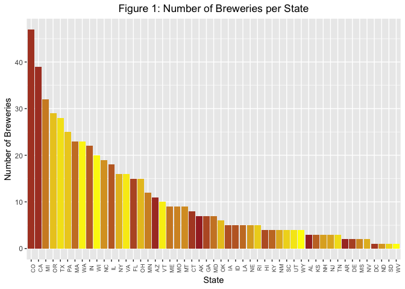
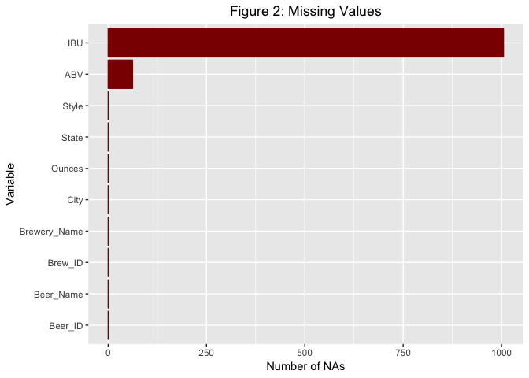
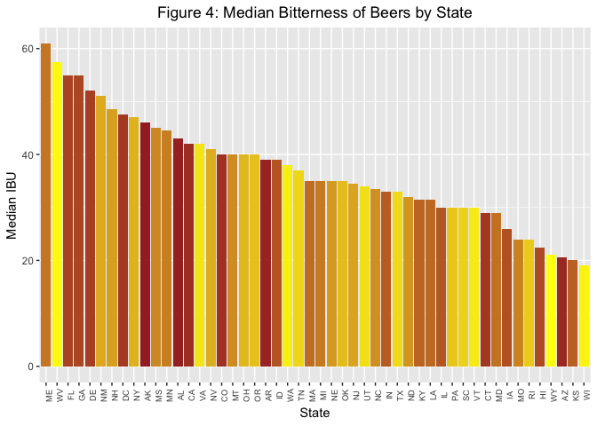
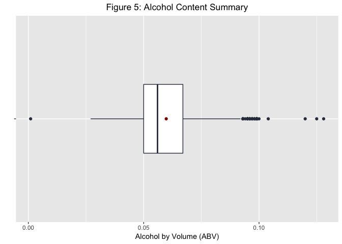
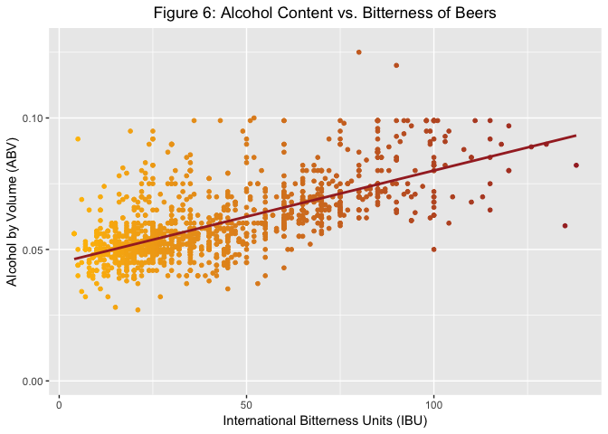

# Introduction

> In 2017, 83 percent of all beer was domestically produced, and 17 percent was imported from more than 100 different countries around the world. 
> Based on beer shipment data and U.S. Census population statistics, U.S. consumers 21 years and older consumed 26.9 gallons of beer and cider per person during 2017. <cite>-- [National Beer Wholesalers Association](https://www.nbwa.org/resources/industry-fast-facts)</cite>

Consumers have many options on the choice of beer they drink today. The beer industry is saturated with regards to production and consumption over the past 10 years. To ward off competition, and to earn a position in the market, it is imperative that brewing companies come up with new strategies. However, large breweries still have the majority market share.

This study will help one of our clients on a marketing campaign. This analysis will determine important questions regarding beer and breweries information for a calculated and appropriate decision. The analysis will also include alcoholic content and bitterness measurements to position the product against competition from other beer manufacturers, including the craft beer industry. Sufficient sample data is available to conduct the study.

# Background

Our client Anheuser-Busch is one of the top beer producers in the world with the following vitals to boast. 
Head quartered in St. Louis MO, the company brews more than 100 brands of beers with flagship brands Budweiser and Bud Light.
The company also owns 23 breweries and has several craft partners to its credit. The company's revenue stands at over 40 billion dollars per year.
Currently the company is eager to introduce a new beer with optimum alcoholic content (ABV) and international bitterness units (IBU), so that they can compete with other breweries and position itself in the market with regards to pricing. 

# Analysis

Our client has requested answers to seven questions, which we will answer in turn. To aid in our analysis, our client provided us with two highly relevant datasets. One dataset contains a list of 2410 craft beers brewed in the United States, while the other contains information on 558 competing U.S. breweries.


#### 1. State-wise brewery counts

Our client would first like to know how many breweries are present in each state. This will give the company an idea of where their competition is geographically located.



The barchart in Figure 1 shows the number of breweries categorized by states in the U.S. (plus District of Columbia). We see that Colorado leads with 47 breweries, followed by California, Michigan, Oregon, and Texas. 

#### 2. Merge beer and breweries data

To fully take advantage of the two datasets, we merged them into one composite dataset. They can be combined because each beer is brewed at, or at least associated with, a particular brewery.

<table class="table table-bordered" style="margin-left: auto; margin-right: auto;">
<caption>Table 1: Beginning of Merged Data Frame</caption>
 <thead>
  <tr>
   <th style="text-align:left;"> Brewery_Name </th>
   <th style="text-align:left;"> City </th>
   <th style="text-align:left;"> State </th>
   <th style="text-align:left;"> Beer_Name </th>
   <th style="text-align:right;"> ABV </th>
   <th style="text-align:right;"> IBU </th>
   <th style="text-align:left;"> Style </th>
   <th style="text-align:right;"> Ounces </th>
  </tr>
 </thead>
<tbody>
  <tr>
   <td style="text-align:left;"> NorthGate Brewing </td>
   <td style="text-align:left;"> Minneapolis </td>
   <td style="text-align:left;"> MN </td>
   <td style="text-align:left;"> Pumpion </td>
   <td style="text-align:right;"> 0.060 </td>
   <td style="text-align:right;"> 38 </td>
   <td style="text-align:left;"> Pumpkin Ale </td>
   <td style="text-align:right;"> 16 </td>
  </tr>
  <tr>
   <td style="text-align:left;"> NorthGate Brewing </td>
   <td style="text-align:left;"> Minneapolis </td>
   <td style="text-align:left;"> MN </td>
   <td style="text-align:left;"> Stronghold </td>
   <td style="text-align:right;"> 0.060 </td>
   <td style="text-align:right;"> 25 </td>
   <td style="text-align:left;"> American Porter </td>
   <td style="text-align:right;"> 16 </td>
  </tr>
  <tr>
   <td style="text-align:left;"> NorthGate Brewing </td>
   <td style="text-align:left;"> Minneapolis </td>
   <td style="text-align:left;"> MN </td>
   <td style="text-align:left;"> Parapet ESB </td>
   <td style="text-align:right;"> 0.056 </td>
   <td style="text-align:right;"> 47 </td>
   <td style="text-align:left;"> Extra Special / Strong Bitter (ESB) </td>
   <td style="text-align:right;"> 16 </td>
  </tr>
  <tr>
   <td style="text-align:left;"> NorthGate Brewing </td>
   <td style="text-align:left;"> Minneapolis </td>
   <td style="text-align:left;"> MN </td>
   <td style="text-align:left;"> Get Together </td>
   <td style="text-align:right;"> 0.045 </td>
   <td style="text-align:right;"> 50 </td>
   <td style="text-align:left;"> American IPA </td>
   <td style="text-align:right;"> 16 </td>
  </tr>
  <tr>
   <td style="text-align:left;"> NorthGate Brewing </td>
   <td style="text-align:left;"> Minneapolis </td>
   <td style="text-align:left;"> MN </td>
   <td style="text-align:left;"> Maggie's Leap </td>
   <td style="text-align:right;"> 0.049 </td>
   <td style="text-align:right;"> 26 </td>
   <td style="text-align:left;"> Milk / Sweet Stout </td>
   <td style="text-align:right;"> 16 </td>
  </tr>
  <tr>
   <td style="text-align:left;"> NorthGate Brewing </td>
   <td style="text-align:left;"> Minneapolis </td>
   <td style="text-align:left;"> MN </td>
   <td style="text-align:left;"> Wall's End </td>
   <td style="text-align:right;"> 0.048 </td>
   <td style="text-align:right;"> 19 </td>
   <td style="text-align:left;"> English Brown Ale </td>
   <td style="text-align:right;"> 16 </td>
  </tr>
</tbody>
</table>

<table class="table table-bordered" style="margin-left: auto; margin-right: auto;">
<caption>Table 2: End of Merged Data Frame</caption>
 <thead>
  <tr>
   <th style="text-align:left;"> Brewery_Name </th>
   <th style="text-align:left;"> City </th>
   <th style="text-align:left;"> State </th>
   <th style="text-align:left;"> Beer_Name </th>
   <th style="text-align:right;"> ABV </th>
   <th style="text-align:right;"> IBU </th>
   <th style="text-align:left;"> Style </th>
   <th style="text-align:right;"> Ounces </th>
  </tr>
 </thead>
<tbody>
  <tr>
   <td style="text-align:left;"> Ukiah Brewing Company </td>
   <td style="text-align:left;"> Ukiah </td>
   <td style="text-align:left;"> CA </td>
   <td style="text-align:left;"> Pilsner Ukiah </td>
   <td style="text-align:right;"> 0.055 </td>
   <td style="text-align:right;"> NA </td>
   <td style="text-align:left;"> German Pilsener </td>
   <td style="text-align:right;"> 12 </td>
  </tr>
  <tr>
   <td style="text-align:left;"> Butternuts Beer and Ale </td>
   <td style="text-align:left;"> Garrattsville </td>
   <td style="text-align:left;"> NY </td>
   <td style="text-align:left;"> Porkslap Pale Ale </td>
   <td style="text-align:right;"> 0.043 </td>
   <td style="text-align:right;"> NA </td>
   <td style="text-align:left;"> American Pale Ale (APA) </td>
   <td style="text-align:right;"> 12 </td>
  </tr>
  <tr>
   <td style="text-align:left;"> Butternuts Beer and Ale </td>
   <td style="text-align:left;"> Garrattsville </td>
   <td style="text-align:left;"> NY </td>
   <td style="text-align:left;"> Snapperhead IPA </td>
   <td style="text-align:right;"> 0.068 </td>
   <td style="text-align:right;"> NA </td>
   <td style="text-align:left;"> American IPA </td>
   <td style="text-align:right;"> 12 </td>
  </tr>
  <tr>
   <td style="text-align:left;"> Butternuts Beer and Ale </td>
   <td style="text-align:left;"> Garrattsville </td>
   <td style="text-align:left;"> NY </td>
   <td style="text-align:left;"> Moo Thunder Stout </td>
   <td style="text-align:right;"> 0.049 </td>
   <td style="text-align:right;"> NA </td>
   <td style="text-align:left;"> Milk / Sweet Stout </td>
   <td style="text-align:right;"> 12 </td>
  </tr>
  <tr>
   <td style="text-align:left;"> Butternuts Beer and Ale </td>
   <td style="text-align:left;"> Garrattsville </td>
   <td style="text-align:left;"> NY </td>
   <td style="text-align:left;"> Heinnieweisse Weissebier </td>
   <td style="text-align:right;"> 0.049 </td>
   <td style="text-align:right;"> NA </td>
   <td style="text-align:left;"> Hefeweizen </td>
   <td style="text-align:right;"> 12 </td>
  </tr>
  <tr>
   <td style="text-align:left;"> Sleeping Lady Brewing Company </td>
   <td style="text-align:left;"> Anchorage </td>
   <td style="text-align:left;"> AK </td>
   <td style="text-align:left;"> Urban Wilderness Pale Ale </td>
   <td style="text-align:right;"> 0.049 </td>
   <td style="text-align:right;"> NA </td>
   <td style="text-align:left;"> English Pale Ale </td>
   <td style="text-align:right;"> 12 </td>
  </tr>
</tbody>
</table>

Table 1 and Table 2 show the respective first and last six observations of the combined file, showing that the merge was a success. We notice that breweries are often repeated in this new dataset, since breweries often make multiple beers.

#### 3. Report column NA's

For our analysis, our client would also like to know the number of NA's, i.e. missing values, in each column. In this way we can be aware that some inaccuracies might occur because not all of the data on each beer and brewery is available.

<table class="table table-bordered" style="width: auto !important; margin-left: auto; margin-right: auto;">
<caption>Table 3: NA Counts</caption>
 <thead>
  <tr>
   <th style="text-align:left;">   </th>
   <th style="text-align:right;"> Number of NAs </th>
  </tr>
 </thead>
<tbody>
  <tr>
   <td style="text-align:left;"> Brew_ID </td>
   <td style="text-align:right;"> 0 </td>
  </tr>
  <tr>
   <td style="text-align:left;"> Brewery_Name </td>
   <td style="text-align:right;"> 0 </td>
  </tr>
  <tr>
   <td style="text-align:left;"> City </td>
   <td style="text-align:right;"> 0 </td>
  </tr>
  <tr>
   <td style="text-align:left;"> State </td>
   <td style="text-align:right;"> 0 </td>
  </tr>
  <tr>
   <td style="text-align:left;"> Beer_Name </td>
   <td style="text-align:right;"> 0 </td>
  </tr>
  <tr>
   <td style="text-align:left;"> Beer_ID </td>
   <td style="text-align:right;"> 0 </td>
  </tr>
  <tr>
   <td style="text-align:left;"> ABV </td>
   <td style="text-align:right;"> 62 </td>
  </tr>
  <tr>
   <td style="text-align:left;"> IBU </td>
   <td style="text-align:right;"> 1005 </td>
  </tr>
  <tr>
   <td style="text-align:left;"> Style </td>
   <td style="text-align:right;"> 0 </td>
  </tr>
  <tr>
   <td style="text-align:left;"> Ounces </td>
   <td style="text-align:right;"> 0 </td>
  </tr>
</tbody>
</table>



From Table 3 we see that there are 62 NA values in the ABV column, and 1005 NA's in the IBU column. There are no null values for the remaining variables. Figure 2 gives an idea of the proportions of missing data between variables. Note that NAs constitute approximately 40% of the data for IBU measurements. Collecting these missing values could increase accuracy in the remainder of the analysis, though there is still adequate information for us to make relevant observations.

#### 4. Median ABV and IBU by state

We would now like to visualize the median alcohol content and bitterness for beers in each respective state. These median values will provide insight into the approximate middle ABV and IBU measurements for all the states.



The alcohol content and bitterness in beers by consuming states are plotted in geometric barcharts, capturing the highest to lowest alcohol by volume and bitterness index. We have two different plots, Figure 3 showing the median ABV and Figure 4 visualizing the median IBU. Note that South Dakota is missing from Figure 4, because there was no data available on bitterness of beers in that state.

#### 5. Maximum ABV and IBU

Next, we want to know the state that has the beer with the largest alcohol content, as well as the state containing the most bitter beer. 

<table class="table table-bordered" style="width: auto !important; margin-left: auto; margin-right: auto;">
<caption>Table 4: Highest ABV</caption>
 <thead>
  <tr>
   <th style="text-align:left;"> State </th>
   <th style="text-align:left;"> Beer_Name </th>
   <th style="text-align:right;"> ABV </th>
   <th style="text-align:left;"> Brewery_Name </th>
  </tr>
 </thead>
<tbody>
  <tr>
   <td style="text-align:left;"> CO </td>
   <td style="text-align:left;"> Lee Hill Series Vol. 5 - Belgian Style Quadrupel Ale </td>
   <td style="text-align:right;"> 0.128 </td>
   <td style="text-align:left;"> Upslope Brewing Company </td>
  </tr>
  <tr>
   <td style="text-align:left;"> KY </td>
   <td style="text-align:left;"> London Balling </td>
   <td style="text-align:right;"> 0.125 </td>
   <td style="text-align:left;"> Against the Grain Brewery </td>
  </tr>
  <tr>
   <td style="text-align:left;"> IN </td>
   <td style="text-align:left;"> Csar </td>
   <td style="text-align:right;"> 0.120 </td>
   <td style="text-align:left;"> Tin Man Brewing Company </td>
  </tr>
</tbody>
</table>

<table class="table table-bordered" style="width: auto !important; margin-left: auto; margin-right: auto;">
<caption>Table 5: Highest IBU</caption>
 <thead>
  <tr>
   <th style="text-align:left;"> State </th>
   <th style="text-align:left;"> Beer_Name </th>
   <th style="text-align:right;"> IBU </th>
   <th style="text-align:left;"> Brewery_Name </th>
  </tr>
 </thead>
<tbody>
  <tr>
   <td style="text-align:left;"> OR </td>
   <td style="text-align:left;"> Bitter Bitch Imperial IPA </td>
   <td style="text-align:right;"> 138 </td>
   <td style="text-align:left;"> Astoria Brewing Company </td>
  </tr>
  <tr>
   <td style="text-align:left;"> VA </td>
   <td style="text-align:left;"> Troopers Alley IPA </td>
   <td style="text-align:right;"> 135 </td>
   <td style="text-align:left;"> Wolf Hills Brewing Company </td>
  </tr>
  <tr>
   <td style="text-align:left;"> MA </td>
   <td style="text-align:left;"> Dead-Eye DIPA </td>
   <td style="text-align:right;"> 130 </td>
   <td style="text-align:left;"> Cape Ann Brewing Company </td>
  </tr>
</tbody>
</table>

As seen from Table 4, the state of Colorado has the maximum alcohol content for beers at 0.128, or 12.8%. In addition, from Table 5 we see that Oregon has the most bitter beer at 138 bitterness units.

#### 6. ABV summary statistics

Here we will see the summary statistics of alcohol by volume for all beers in the United States, which may establish the most popular alcohol levels found in beer.

<table class="table table-bordered" style="width: auto !important; margin-left: auto; margin-right: auto;">
<caption>Table 6: ABV Summary Statistics</caption>
 <thead>
  <tr>
   <th style="text-align:left;"> Statistic </th>
   <th style="text-align:right;"> ABV Value </th>
  </tr>
 </thead>
<tbody>
  <tr>
   <td style="text-align:left;width: 2.75cm; "> Min. </td>
   <td style="text-align:right;width: 2.75cm; "> 0.001 </td>
  </tr>
  <tr>
   <td style="text-align:left;width: 2.75cm; "> 1st Qu. </td>
   <td style="text-align:right;width: 2.75cm; "> 0.050 </td>
  </tr>
  <tr>
   <td style="text-align:left;width: 2.75cm; "> Median </td>
   <td style="text-align:right;width: 2.75cm; "> 0.056 </td>
  </tr>
  <tr>
   <td style="text-align:left;width: 2.75cm; "> Mean </td>
   <td style="text-align:right;width: 2.75cm; "> 0.060 </td>
  </tr>
  <tr>
   <td style="text-align:left;width: 2.75cm; "> 3rd Qu. </td>
   <td style="text-align:right;width: 2.75cm; "> 0.067 </td>
  </tr>
  <tr>
   <td style="text-align:left;width: 2.75cm; "> Max. </td>
   <td style="text-align:right;width: 2.75cm; "> 0.128 </td>
  </tr>
  <tr>
   <td style="text-align:left;width: 2.75cm; "> NA's </td>
   <td style="text-align:right;width: 2.75cm; "> 62.000 </td>
  </tr>
</tbody>
</table>



The summary in Table 6 includes the minimum, median, mean, and maximum of alcohol by volume. In percentages these values represent 0.1%, 5.6% , 6% and 12.8% alcohol by volume, respectively. The boxplot in Figure 5 references the distribution of ABV values. We see from the plot that the data have a slight right skew because of the outliers on the higher end, but the highest concentration of values is in the 5-7% alcohol content range.

#### 7. IBU and ABV relationship

Finally, we created a scatterplot to determine whether there is an apparent relationship between bitterness and alcohol content in beers. We also performed a statistical hypothesis test to indicate the existence and strength of a linear correlation between the variables. 



```
## 
## 	Pearson's product-moment correlation
## 
## data:  IBU and ABV
## t = 33.863, df = 1403, p-value < 2.2e-16
## alternative hypothesis: true correlation is not equal to 0
## 95 percent confidence interval:
##  0.6407982 0.6984238
## sample estimates:
##       cor 
## 0.6706215
```

The scatterplot in Figure 6 shows a moderately strong positive linear correlation between the IBU and ABV of beers. This is supported by the Pearson correlation coefficient of 0.67 and a very small *p*-value, indicating a significant linear relationship (*p* < 0.0001). As bitterness increases we see that alcohol content tends to increase as well, barring some outliers. The line drawn through the scatter plot represents the line of best fit, which enables us to predict alcohol content from a given bitterness level based on trends in the data.

# Conclusion

Considering the given results and the market trends analyzed thus far, the CEO of Anheuser-Busch can make an informed decision regarding the launch of a new product. Because the company is well-established and its brands are known to sell, we believe that they can initally introduce the product in the top 10 consuming and producing states where they will experience high sales rates. In addition, the new brew should have optimum ABV and IBU to satisfy the current consumer trends in beer drinking. Thus we recommend that the product follow the linear IBU and ABV relationship seen in Figure 6, since these types of beers continue to be brewed and sold. Finally, we believe that collaboration between Anheuser-Busch and other craft beer breweries would be benenficial, as such partnerships can assist in meeting local consumer needs and raising customer satisfaction. We are confident that making thoughtful product decisions, grounded by insights from data, will propel the company to success.

# Presentation

This write-up is supplemented by video presentations from both consultants of K n A Marketing. The links are provided below.

Anand: Presentation of powerpoint slides video on YouTube - [link](https://youtu.be/YwA7hsq_Fx0)

Kristen: Video presentation [link](https://youtu.be/O4ApbhmVJ_E)
