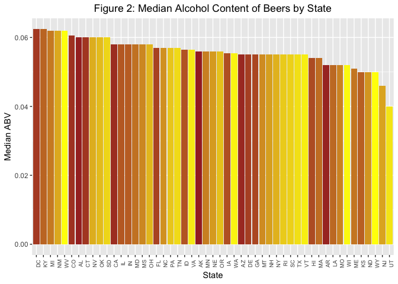
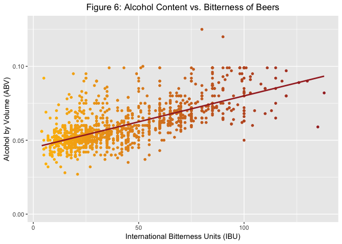

# Introduction

In 2017, 83 percent of all beer was domestically produced, and 17 percent was imported from more than 100 different countries around the world. Based on beer shipment data and U.S. Census population statistics, U.S. consumers 21 years and older consumed 26.9 gallons of beer and cider per person during 2017. (Source: https://www.nbwa.org/resources/industry-fast-facts)

Consumers have many options on the choice of beer they drink today. The beer industry is saturated with regards to production and consumption over the past 10 years. To ward off competition, and to earn a position in the market, it is imperative that brewing companies come up with new strategies. However, large breweries still have the majority market share.

This study will help one of our clients on a marketing campaign. This analysis will determine certain important questions on the Beer and Breweries information for a calculated and appropriate decision. The analysis will also include alcoholic content and IBU (international bitterness unit) to position the product against competition from other beer manufacturers, including the craft beer industry. Enough sample data is available to conduct the study/analysis.

# Background

Our client Anheuser Busch is one of the top Beer producer with the following vitals to boast. 
Head quartered in St Louis MO, the company brews more than 100 brands of beers with flag ship brands Budweiser and Budlight.
The company also owns 23 breweries and has several craft partners to its credit. The company's revenue stands at 14 Billion dollasr per year.
Currently our the company is eager to introduce a new beer with optimum alcoholic content (ABV) and international bitterness units (IBU), so that they can compete with other breweries and position itself in the market with regards to pricing. This will be an important feature in their marketing campaign and advertisement for the product in the upcoming NFL halftime commercial (most watched) with enhanced visual effects. The strategy will create awareness and curiosity around this new beer with the consumers(Budweiser enthusiasts!). 

# Analysis

To aid in our analysis, our client provided us with two highly relevant datasets. One dataset contains a list of 2410 craft beers brewed in the U.S., while the other contains information on 558 competing U.S. breweries. As we are using the programming language R to perform our analysis, we first have to load these datasets into R. In order to show some good analysis, we had cleaned up the data to show information where the data is available.


```r
# Read in beer and brewery data files
beers <- read.csv("DataFiles/beers.csv")
breweries <- read.csv("DataFiles/breweries.csv")
```

#### 1. State-wise brewery counts

Our client would first like to know how many breweries are present in each state. This will given the company an idea of where their competition is geographically located.


```r
# Count number of breweries in each state
cdf <- plyr::count(breweries, 'State')
colnames(cdf)<- c("State","NumberOfBreweries")

# Create HTML table widget
datatable(cdf)
```

<!--html_preserve--><div id="htmlwidget-bbc06ebe84acfd0e36d6" style="width:100%;height:auto;" class="datatables html-widget"></div>
<script type="application/json" data-for="htmlwidget-bbc06ebe84acfd0e36d6">{"x":{"filter":"none","data":[["1","2","3","4","5","6","7","8","9","10","11","12","13","14","15","16","17","18","19","20","21","22","23","24","25","26","27","28","29","30","31","32","33","34","35","36","37","38","39","40","41","42","43","44","45","46","47","48","49","50","51"],[" AK"," AL"," AR"," AZ"," CA"," CO"," CT"," DC"," DE"," FL"," GA"," HI"," IA"," ID"," IL"," IN"," KS"," KY"," LA"," MA"," MD"," ME"," MI"," MN"," MO"," MS"," MT"," NC"," ND"," NE"," NH"," NJ"," NM"," NV"," NY"," OH"," OK"," OR"," PA"," RI"," SC"," SD"," TN"," TX"," UT"," VA"," VT"," WA"," WI"," WV"," WY"],[7,3,2,11,39,47,8,1,2,15,7,4,5,5,18,22,3,4,5,23,7,9,32,12,9,2,9,19,1,5,3,3,4,2,16,15,6,29,25,5,4,1,3,28,4,16,10,23,20,1,4]],"container":"<table class=\"display\">\n  <thead>\n    <tr>\n      <th> <\/th>\n      <th>State<\/th>\n      <th>NumberOfBreweries<\/th>\n    <\/tr>\n  <\/thead>\n<\/table>","options":{"columnDefs":[{"className":"dt-right","targets":2},{"orderable":false,"targets":0}],"order":[],"autoWidth":false,"orderClasses":false}},"evals":[],"jsHooks":[]}</script><!--/html_preserve-->

The table above shows the number of breweries, categorized by states in the U.S. (plus District of Columbia). For instance, there are 7 breweries in Alaska, 3 in Alabama, and so on. One can query and get details of a particular state or sort the order by number of breweries ascending or descending.

#### 2. Merge beer and breweries data

To fully take advantage of the two datasets, we merge them into one composite dataset. They can be combined because each beer is brewed at, or at least associated with, a particular brewery.


```r
# Merge data on brewery ID fields
beer_data <- merge(breweries, beers, by.x='Brew_ID', by.y='Brewery_id', all=TRUE)
# Rename ambiguous columns
names(beer_data)[c(2, 5)] <- c("Brewery_Name", "Beer_Name")

# Display beginning of merged data frame
hd <- head(beer_data)
datatable(hd)
```

<!--html_preserve--><div id="htmlwidget-c55c9292a00b33f410a1" style="width:100%;height:auto;" class="datatables html-widget"></div>
<script type="application/json" data-for="htmlwidget-c55c9292a00b33f410a1">{"x":{"filter":"none","data":[["1","2","3","4","5","6"],[1,1,1,1,1,1],["NorthGate Brewing ","NorthGate Brewing ","NorthGate Brewing ","NorthGate Brewing ","NorthGate Brewing ","NorthGate Brewing "],["Minneapolis","Minneapolis","Minneapolis","Minneapolis","Minneapolis","Minneapolis"],[" MN"," MN"," MN"," MN"," MN"," MN"],["Pumpion","Stronghold","Parapet ESB","Get Together","Maggie's Leap","Wall's End"],[2689,2688,2687,2692,2691,2690],[0.06,0.06,0.056,0.045,0.049,0.048],[38,25,47,50,26,19],["Pumpkin Ale","American Porter","Extra Special / Strong Bitter (ESB)","American IPA","Milk / Sweet Stout","English Brown Ale"],[16,16,16,16,16,16]],"container":"<table class=\"display\">\n  <thead>\n    <tr>\n      <th> <\/th>\n      <th>Brew_ID<\/th>\n      <th>Brewery_Name<\/th>\n      <th>City<\/th>\n      <th>State<\/th>\n      <th>Beer_Name<\/th>\n      <th>Beer_ID<\/th>\n      <th>ABV<\/th>\n      <th>IBU<\/th>\n      <th>Style<\/th>\n      <th>Ounces<\/th>\n    <\/tr>\n  <\/thead>\n<\/table>","options":{"columnDefs":[{"className":"dt-right","targets":[1,6,7,8,10]},{"orderable":false,"targets":0}],"order":[],"autoWidth":false,"orderClasses":false}},"evals":[],"jsHooks":[]}</script><!--/html_preserve-->

```r
# Display end of merged data frame
tl <- tail(beer_data)
datatable(tl)
```

<!--html_preserve--><div id="htmlwidget-831466ec30cbe29bb9e5" style="width:100%;height:auto;" class="datatables html-widget"></div>
<script type="application/json" data-for="htmlwidget-831466ec30cbe29bb9e5">{"x":{"filter":"none","data":[["2405","2406","2407","2408","2409","2410"],[556,557,557,557,557,558],["Ukiah Brewing Company","Butternuts Beer and Ale","Butternuts Beer and Ale","Butternuts Beer and Ale","Butternuts Beer and Ale","Sleeping Lady Brewing Company"],["Ukiah","Garrattsville","Garrattsville","Garrattsville","Garrattsville","Anchorage"],[" CA"," NY"," NY"," NY"," NY"," AK"],["Pilsner Ukiah","Porkslap Pale Ale","Snapperhead IPA","Moo Thunder Stout","Heinnieweisse Weissebier","Urban Wilderness Pale Ale"],[98,49,51,50,52,30],[0.055,0.043,0.068,0.049,0.049,0.049],[null,null,null,null,null,null],["German Pilsener","American Pale Ale (APA)","American IPA","Milk / Sweet Stout","Hefeweizen","English Pale Ale"],[12,12,12,12,12,12]],"container":"<table class=\"display\">\n  <thead>\n    <tr>\n      <th> <\/th>\n      <th>Brew_ID<\/th>\n      <th>Brewery_Name<\/th>\n      <th>City<\/th>\n      <th>State<\/th>\n      <th>Beer_Name<\/th>\n      <th>Beer_ID<\/th>\n      <th>ABV<\/th>\n      <th>IBU<\/th>\n      <th>Style<\/th>\n      <th>Ounces<\/th>\n    <\/tr>\n  <\/thead>\n<\/table>","options":{"columnDefs":[{"className":"dt-right","targets":[1,6,7,8,10]},{"orderable":false,"targets":0}],"order":[],"autoWidth":false,"orderClasses":false}},"evals":[],"jsHooks":[]}</script><!--/html_preserve-->

The above display show the first and last six observations of the combined file, showing that the merge was a success. We notice that breweries are often repeated in this new dataset, since breweries often make multiple beers. Also notice that some IBU values are blank, indicating missing or unavailable values in the original datasets.

#### 3. Report column NA's

For our analysis, we would also like to know the number of NA's, i.e. missing values, in each column. In this way we can be aware that some inaccuracies might occur because not all of the data on each beer and brewery is available.


```r
# Get all the NA data from beer data
na_table <- sapply(beer_data, function(x) sum(is.na(x)))
na_df <- as.data.frame(na_table)
na_df <- cbind(rownames(na_df), na_df)
rownames(na_df) <- NULL
names(na_df) <- c("Variable", "NumberOfNAs")
# Create table for NA counts
datatable(na_df)
```

<!--html_preserve--><div id="htmlwidget-88f9a376673bd452d642" style="width:100%;height:auto;" class="datatables html-widget"></div>
<script type="application/json" data-for="htmlwidget-88f9a376673bd452d642">{"x":{"filter":"none","data":[["1","2","3","4","5","6","7","8","9","10"],["Brew_ID","Brewery_Name","City","State","Beer_Name","Beer_ID","ABV","IBU","Style","Ounces"],[0,0,0,0,0,0,62,1005,0,0]],"container":"<table class=\"display\">\n  <thead>\n    <tr>\n      <th> <\/th>\n      <th>Variable<\/th>\n      <th>NumberOfNAs<\/th>\n    <\/tr>\n  <\/thead>\n<\/table>","options":{"columnDefs":[{"className":"dt-right","targets":2},{"orderable":false,"targets":0}],"order":[],"autoWidth":false,"orderClasses":false}},"evals":[],"jsHooks":[]}</script><!--/html_preserve-->

From this output, we see that there are 62 NA values in the ABV column, and 1005 NA's in the IBU column. There are no null values for the remaining variables.

#### 4. Median ABV and IBU by state

We would like to visualize the median alcohol content and bitterness for beers in each state. We use the ggplot2 package in R to create this visualization.


```r
# Get median values for each state, convert to data frames
median_ABV <- tapply(beer_data$ABV, beer_data$State, median, na.rm=TRUE)
median_IBU <- tapply(beer_data$IBU, beer_data$State, median, na.rm=TRUE)
median_ABV <- as.data.frame(median_ABV); median_ABV$State <- rownames(median_ABV)
median_IBU <- as.data.frame(median_IBU); median_IBU$State <- rownames(median_IBU)

# Define color gradient
grad <- scales::seq_gradient_pal("brown", "yellow")(seq(0,1,length.out=51))
# Create barchart for median ABV
ggplot(median_ABV, aes(x=reorder(State, -median_ABV), y=median_ABV, fill=State)) +
  geom_bar(stat='identity', position='dodge') +
  labs(title="Median Alcohol Content of Beers by State", x="State", y="Median ABV") +
  theme(plot.title = element_text(hjust=0.5), axis.text.x=element_text(angle=90, size=7), legend.position="none") +     
  scale_fill_manual(values=grad)
```



```r
# Create barchart for median IBU
ggplot(median_IBU, aes(x=reorder(State, -median_IBU), y=median_IBU, fill=State)) +
  geom_bar(stat='identity', position='dodge', na.rm=TRUE) +
  labs(title="Median Bitterness of Beers by State", x="State", y="Median IBU") +
  theme(plot.title = element_text(hjust=0.5), axis.text.x=element_text(angle=90, size=7), legend.position="none") +     
  scale_fill_manual(values=grad)
```


The alcohol content in beers by consuming states are plotted in a geometric bar graph where the highest to lowest alcohol by volume and bitterness index are captured. We have two different plots one showing the median ABV and another the median IBU.

#### 5. Maximum ABV and IBU

Next, we want to know the state that has the beer with the largest alcohol content, as well as the state containing the most bitter beer.


```r
# Get maximum alcohol content
beer_data[which.max(beer_data$ABV), c("State", "Beer_Name", "ABV")]
```

```
##     State                                            Beer_Name   ABV
## 384    CO Lee Hill Series Vol. 5 - Belgian Style Quadrupel Ale 0.128
```

```r
# Get maximum IBU
beer_data[which.max(beer_data$IBU), c("State", "Beer_Name", "IBU")]
```

```
##      State                 Beer_Name IBU
## 1857    OR Bitter Bitch Imperial IPA 138
```

As seen from the results, the state of Colorado has the maximum alcohol content in beer. In addition, Oregon appears to have the most bitter beer.

#### 6. ABV summary statistics

We will see the symmary statistics of alcohol by volume for all the beers in the United States.


```r
summary(beer_data$ABV, na.rm=TRUE)
```

```
##    Min. 1st Qu.  Median    Mean 3rd Qu.    Max.    NA's 
## 0.00100 0.05000 0.05600 0.05977 0.06700 0.12800      62
```

The summary shows the minimum, the mean, median and maximum of alcohol by volume (ABV).
In percentage of alcohol content it would be 1%, 5.6% , 5.9 % and 12.8% by volume.   

#### 7. IBU and ABV relationship


```r
# Create scatterplot
ggplot(beer_data, aes(x=IBU, y=ABV, color=IBU, fill="white")) + 
  geom_point(size=1.3, na.rm=TRUE) + 
  labs(title="Bitterness vs. Alcohol Content of Beers", x="International Bitterness Units (IBU)", y="Alcohol by Volume (ABV)") +
  theme(plot.title = element_text(hjust=0.5), legend.position="none") +
  scale_color_gradient(low = "#ffbf00", high = "brown")
```



The scatter plot shows a linear correlation between the IBU and ABV of beers.
The more the IBU we see that the ABV is also higher barring some outliers.

# Conclusion

TODO
