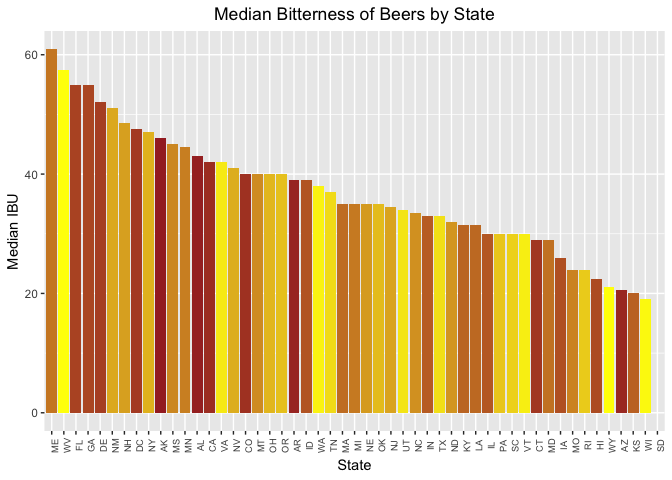

# Introduction

In 2017, 83 percent of all beer was domestically produced, and 17 percent was imported from more than 100 different countries around the world. Based on beer shipment data and U.S. Census population statistics, U.S. consumers 21 years and older consumed 26.9 gallons of beer and cider per person during 2017. (Source: https://www.nbwa.org/resources/industry-fast-facts)

Consumers have many options on the choice of beer they drink today. The beer industry is saturated with regards to production and consumption over the past 10 years. To ward off competition, and to earn a position in the market, it is imperative that brewing companies come up with new strategies. However, large breweries still have the majority market share.

This study will help one of our clients on a marketing campaign. This analysis will determine certain important questions on the Beer and Breweries information for a calculated and appropriate decision. The analysis will also include alcoholic content and IBU (international bitterness unit) to position the product against competition from other beer manufacturers, including the craft beer industry. Enough sample data is available to conduct the study/analysis.

# Background

Our client Anheuser Busch is one of the top Beer producer with the following vitals to boast. 
Head quartered in St Louis MO, the company brews more than 100 brands of beers with flag ship brands Budweiser and Budlight.
The company also owns 23 breweries and has several craft partners to its credit. The company's revenue stands at 14 Billion dollasr per year.
Currently our the company is eager to introduce a new beer with optimum alcoholic content (ABV) and international bitterness units (IBU), so that they can compete with other breweries and position itself in the market with regards to pricing. This will be an important feature in their marketing campaign and advertisement for the product in the upcoming NFL halftime commercial (most watched) with enhanced visual effects. The strategy will create awareness and curiosity around this new beer with the consumers(Budweiser enthusiasts!). 

# Analysis

To aid in our analysis, our client provided us with two highly relevant datasets. One dataset contains a list of 2410 craft beers brewed in the U.S., while the other contains information on 558 competing U.S. breweries. As we are using the programming language R to perform our analysis, we first have to load these datasets into R.


```r
# Read in beer and brewery data files
beers <- read.csv("DataFiles/beers.csv")
breweries <- read.csv("DataFiles/breweries.csv")
```

#### 1. State-wise brewery counts

Our client would first like to know how many breweries are present in each state. This will given the company an idea of where their competition is geographically located.


```r
# Count number of breweries in each state
table(breweries$State)
```

```
## 
##  AK  AL  AR  AZ  CA  CO  CT  DC  DE  FL  GA  HI  IA  ID  IL  IN  KS  KY 
##   7   3   2  11  39  47   8   1   2  15   7   4   5   5  18  22   3   4 
##  LA  MA  MD  ME  MI  MN  MO  MS  MT  NC  ND  NE  NH  NJ  NM  NV  NY  OH 
##   5  23   7   9  32  12   9   2   9  19   1   5   3   3   4   2  16  15 
##  OK  OR  PA  RI  SC  SD  TN  TX  UT  VA  VT  WA  WI  WV  WY 
##   6  29  25   5   4   1   3  28   4  16  10  23  20   1   4
```

The table above shows the number of breweries, categorized by states in the U.S. (plus District of Columbia). For instance, there are 7 breweries in Alaska, 3 in Alabama, and so on.

#### 2. Merge beer and breweries data

To fully take advantage of the two datasets, we merge them into one composite dataset. They can be combined because each beer is brewed at, or at least associated with, a particular brewery.


```r
# Merge data on brewery ID fields
beer_data <- merge(breweries, beers, by.x='Brew_ID', by.y='Brewery_id', all=TRUE)
# Rename ambiguous columns
names(beer_data)[c(2, 5)] <- c("Brewery_Name", "Beer_Name")
# Display beginning and end of data frame
head(beer_data)
```

```
##   Brew_ID       Brewery_Name        City State     Beer_Name Beer_ID   ABV
## 1       1 NorthGate Brewing  Minneapolis    MN       Pumpion    2689 0.060
## 2       1 NorthGate Brewing  Minneapolis    MN    Stronghold    2688 0.060
## 3       1 NorthGate Brewing  Minneapolis    MN   Parapet ESB    2687 0.056
## 4       1 NorthGate Brewing  Minneapolis    MN  Get Together    2692 0.045
## 5       1 NorthGate Brewing  Minneapolis    MN Maggie's Leap    2691 0.049
## 6       1 NorthGate Brewing  Minneapolis    MN    Wall's End    2690 0.048
##   IBU                               Style Ounces
## 1  38                         Pumpkin Ale     16
## 2  25                     American Porter     16
## 3  47 Extra Special / Strong Bitter (ESB)     16
## 4  50                        American IPA     16
## 5  26                  Milk / Sweet Stout     16
## 6  19                   English Brown Ale     16
```

```r
tail(beer_data)
```

```
##      Brew_ID                  Brewery_Name          City State
## 2405     556         Ukiah Brewing Company         Ukiah    CA
## 2406     557       Butternuts Beer and Ale Garrattsville    NY
## 2407     557       Butternuts Beer and Ale Garrattsville    NY
## 2408     557       Butternuts Beer and Ale Garrattsville    NY
## 2409     557       Butternuts Beer and Ale Garrattsville    NY
## 2410     558 Sleeping Lady Brewing Company     Anchorage    AK
##                      Beer_Name Beer_ID   ABV IBU                   Style
## 2405             Pilsner Ukiah      98 0.055  NA         German Pilsener
## 2406         Porkslap Pale Ale      49 0.043  NA American Pale Ale (APA)
## 2407           Snapperhead IPA      51 0.068  NA            American IPA
## 2408         Moo Thunder Stout      50 0.049  NA      Milk / Sweet Stout
## 2409  Heinnieweisse Weissebier      52 0.049  NA              Hefeweizen
## 2410 Urban Wilderness Pale Ale      30 0.049  NA        English Pale Ale
##      Ounces
## 2405     12
## 2406     12
## 2407     12
## 2408     12
## 2409     12
## 2410     12
```

The above output from R shows the first and last six observations of the combined file, showing that the merge was a success. We notice that breweries are often repeated in this new dataset, since breweries often make multiple beers. 

#### 3. Report column NA's

For our analysis, we would also like to know the number of NA's, i.e. missing values, in each column. In this way we can be aware that some inaccuracies might occur because not all of the data on each beer and brewery is available.


```r
# Get all the NA data from beer Data
sapply(beer_data, function(x) sum(is.na(x)))
```

```
##      Brew_ID Brewery_Name         City        State    Beer_Name 
##            0            0            0            0            0 
##      Beer_ID          ABV          IBU        Style       Ounces 
##            0           62         1005            0            0
```

From this output, we see that there are 62 NA values in the ABV column, and 1005 NA's in the IBU column. There are no null values for the remaining variables.

#### 4. Median ABV and IBU by state

We would like to visualize the median alcohol content and bitterness for beers in each state. We use the ggplot2 package in R to create this visualization.


```r
library(ggplot2)
```

```r
# Get median values for each state, convert to data frames
median_ABV <- tapply(beer_data$ABV, beer_data$State, median, na.rm=TRUE)
median_IBU <- tapply(beer_data$IBU, beer_data$State, median, na.rm=TRUE)
median_ABV <- as.data.frame(median_ABV); median_ABV$State <- rownames(median_ABV)
median_IBU <- as.data.frame(median_IBU); median_IBU$State <- rownames(median_IBU)

# Create barchart for median ABV
ggplot(median_ABV, aes(x=reorder(State, -median_ABV), y=median_ABV, fill=State)) +
  geom_bar(stat='identity', position='dodge') +
  labs(title="Median Alcohol Content of Beers by State", x="State", y="Median ABV") +
  theme(plot.title = element_text(hjust=0.5), axis.text.x=element_text(angle=90, size=7), legend.position="none")
```


```r
# Create barchart for median IBU
ggplot(median_IBU, aes(x=reorder(State, -median_IBU), y=median_IBU, fill=State)) +
  geom_bar(stat='identity', position='dodge') +
  labs(title="Median Bitterness of Beers by State", x="State", y="Median IBU") +
  theme(plot.title = element_text(hjust=0.5), axis.text.x=element_text(angle=90, size=7), legend.position="none")
```

```
## Warning: Removed 1 rows containing missing values (geom_bar).
```



TODO explain

#### 5. Maximum ABV and IBU

Next, we want to know the state that has the beer with the largest alcohol content, as well as the state containing the most bitter beer.


```r
# Get maximum alcohol content
beer_data[which.max(beer_data$ABV), c("State", "Beer_Name", "ABV")]
```

```
##     State                                            Beer_Name   ABV
## 384    CO Lee Hill Series Vol. 5 - Belgian Style Quadrupel Ale 0.128
```

```r
# Get maximum IBU
beer_data[which.max(beer_data$IBU), c("State", "Beer_Name", "IBU")]
```

```
##      State                 Beer_Name IBU
## 1857    OR Bitter Bitch Imperial IPA 138
```

As seen from the results, the state of Colorado has the maximum alcoholic beer. In addition, Oregon appears to have the most bitter beer.

#### 6. ABV summary statistics

TODO

#### 7. IBU and ABV relationship

TODO

# Conclusion

TODO
